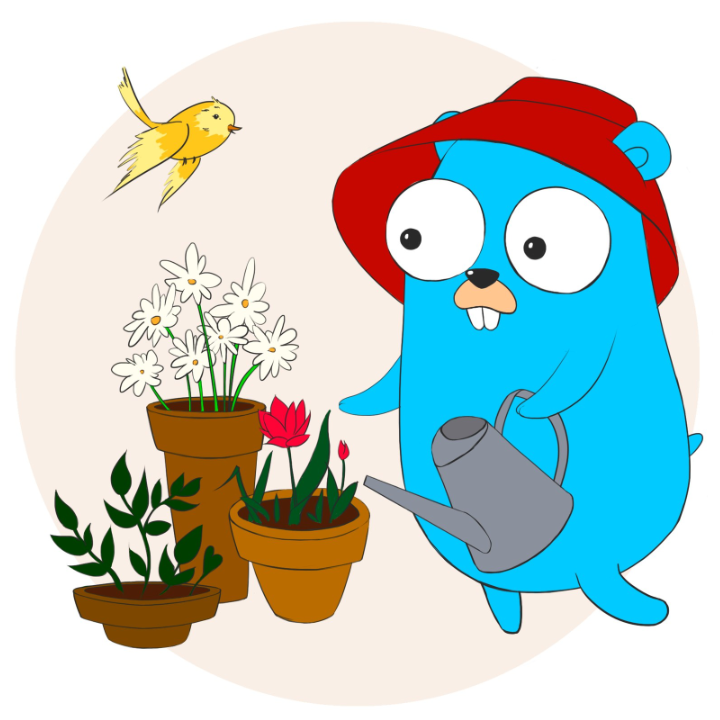

В одном из проектов мне приходилось выполнять различные манипуляции с **JSON**, а затем рендерить. Время ответа веб-сервера было велико и стремилось к пяти секундам, но после реализации кеширования удалось сократить до двухсот миллисекунд.

Основное преимущество данного алгоритма в том, что веб-сервер отвечает без блокировки на генерацию кеша, если срок его действия истек.

Весь код можно разделить на три этапа — декодирование, кеширование и запуск.

## 1. Декодирование JSON

Перед тем как начать, выполним `go get github.com/pmylund/go-cache` и `go get github.com/unrolled/render` из консоли, а затем импортируем пакеты. Ключевое звено в кешировании — пакет <a href="https://github.com/pmylund/go-cache/" title="caching in Golang" target="_blank">github.com/pmylund/go-cache</a>, который представляет собой key:value хранилище в памяти. Главным преимуществом **go-cache** является то, что не нужно сериализовать и передавать данные по сети.
```
package main

import (
	"encoding/json"
	gocache "github.com/pmylund/go-cache"
	"github.com/unrolled/render"
	"net/http"
	"time"
)
```

Заранее инициализируем кеш со сроком действия пять минут и чисткой каждые 30 секунд.
```
var (
	cache = gocache.New(5*time.Minute, 30*time.Second)
)
```

В качестве примера так же добавим новую структуру `Data`.
```
type Data struct {
	Name        string `json:"name"`
	Description string `json:"description"`
}
```

Функция `getJson()` нужна для декодирования JSON. На входе тип `interface{}` и URL типа `string`.
С помощью `http.Get()` получаем ответ и, как вы уже заметили, используем Decode вместо Unmarshal, так как Decode умеет читать из потока.
```
func getJson(this interface{}, url string) error {
	res, err := http.Get(url)
	if err != nil {
		return err
	}
	defer res.Body.Close()

	return json.NewDecoder(res.Body).Decode(this)
}
```

## 2. Кеширование JSON
Немного ниже функция-прокладка для кеширования результатов инициализации `getJson()`.
На входе структура `Data` и URL типа `string`, на выходе `interface{}` и тип `bool`.

Если ключ data найден и срок действия не истек, то записываем/обновляем ключ data_tmp с неограниченным сроком действия и возвращаем закешированный ответ из data.

Иначе, если ключ data не найден или срок действия истек, но найден data_tmp, то во втором потоке инициализируем `getJson()` и обновляем ключ data. При этом возвращаем закешированный ответ из data_tmp.

В другом случае, если ключи ни data, ни data_tmp не найдены, то инициализируем `getJson()` и записываем кеш. Эти действия вызовут небольшую задержку, но, думаю, что это не страшно, так как бывает всего один раз (при каждом запуске веб-сервера).

```
func loadData(this *Data, url string) (interface{}, bool) {
	if cached, found := cache.Get("data"); found {
		cache.Set("data_tmp", cached, gocache.NoExpiration)
		return cached, found
	}

	if cached_tmp, found_tmp := cache.Get("data_tmp"); found_tmp {
		go func() {
			getJson(this, url)
			cache.Set("data", this, gocache.DefaultExpiration)
		}()
		return cached_tmp, found_tmp
	}

	getJson(this, url)
	cache.Set("data", this, gocache.DefaultExpiration)

	return this, false
}
```

## 3. Запуск веб-сервера
Добавим простую функцию для установки новых заголовков в ответ.
Внимание стоит уделить Access-Control-Allow-Origin и Access-Control-Allow-Methods, здесь можно разрешить доступ с определенных доменов и установить допустимые методы, о чем было в предыдущем <a href="http://ashk.io/articles/examples/golang-cors-proxy/" title="Разработка CORS веб-сервера на Go" target="_blank">посте</a>.
```
func setDefaultHeaders(w http.ResponseWriter) {
	w.Header().Set("Access-Control-Allow-Origin", "*")
	w.Header().Set("Access-Control-Allow-Methods", "GET")
	w.Header().Set("Cache-Control", "no-store, no-cache, must-revalidate, post-check=0, pre-check=0")
	w.Header().Set("Content-Type", "application/json; charset=UTF-8")
	w.Header().Set("Vary", "Accept-Encoding")
}
```

Добавим функцию `setCacheHeader()` для того, что бы в заголовке ответа выводить статус. Если ответ кеширован, то X-Cache HIT, иначе MISS. Для этого нам и понадобился тип `bool` в функции `loadData()`.
```
func setCacheHeader(w http.ResponseWriter, found bool) {
	v := "MISS"
	if found {
		v = "HIT"
	}
	w.Header().Set("X-Cache", v)
}
```

В функции `main()`, как правило, инициализация других функций, рендеринг и запуск веб-сервера.
```
func main() {
	render := render.New()
	mux := http.NewServeMux()

	mux.HandleFunc("/", func(w http.ResponseWriter, r *http.Request) {
		setDefaultHeaders(w)

		data := new(Data)
		url := ""

		res, found := loadData(data, url)
		setCacheHeader(w, found)

		render.JSON(w, http.StatusOK, res)
	})

	http.ListenAndServe(":8000", mux)
}
```

На этом всё, надеюсь, этот код натолкнул вас на мысли.

Если хотите сохранить код на будущее, то его можно найти на <a href="https://gist.github.com/wpioneer/0d5c2fb110e19203655e04f4a52e9d87" title="Golang JSON Cache Example" target="_blank">Github Gist</a>.